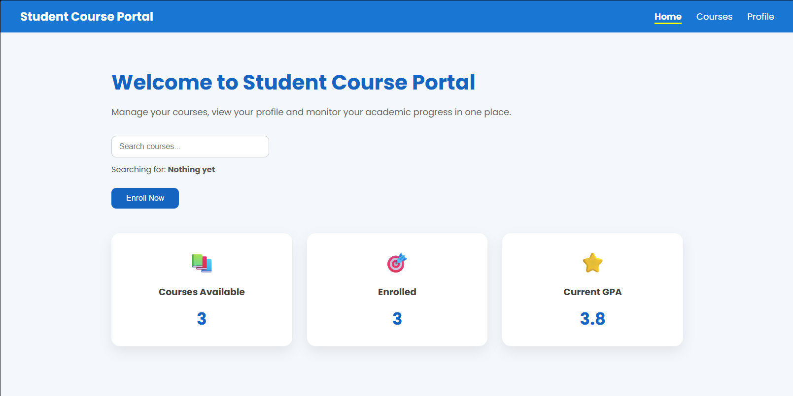
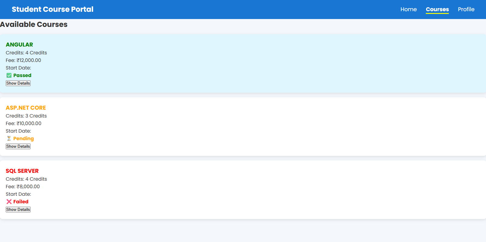
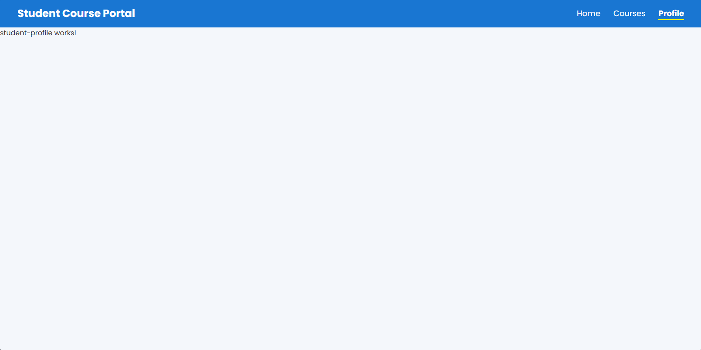

# 🎓 Student Course Portal

An interactive single-page application built using **Angular** and a **JSON-Server REST API** backend, developed as part of the **Cognizant Digital Nurture 5.0 Deep Skilling** curriculum.

---

## 🌟 Key Features

* **Interactive Home Dashboard:** Displays live academic metrics including available courses, enrolled courses, and GPA tracking, alongside search functionality.
* **Course Catalog:** View detailed listings for courses (Angular, ASP.NET Core, SQL Server) with credits, fees in INR, status badges (*Passed*, *Pending*, *Failed*), and expandable course details.
* **Student Profile Routing:** Dedicated Angular routes to navigate seamlessly between Home, Courses, and Profile views.
* **REST API Integration:** Connected to a mock backend API powered by `json-server` running on port 3000.

---

## 🖼️ Application Screenshots

### 1. Home Dashboard

> *Home page showcasing quick stats counters, interactive search, and quick action buttons.*

### 2. Available Courses Catalog

> *Course catalog view featuring status indicators, credit hours, course fees, and detail toggles.*

### 3. Student Profile View

> *Dedicated component route for managing student profile information.*

---

## 🛠️ Tech Stack

* **Frontend:** Angular, TypeScript, HTML5, CSS3
* **Backend API:** JSON-Server (`db.json`)
* **Routing:** Angular Router
* **Package Manager:** npm

---

## 🚀 Getting Started

Follow these steps to run the project locally on your machine:

### Prerequisites
* **Node.js** (v18 or higher recommended)
* **Angular CLI** (`npm install -g @angular/cli`)

### Step 1: Install Dependencies
Navigate into the project directory and install the required packages:
```bash
cd student_course_portal
npm install

Step 2: Start the Mock REST API Server
Launch json-server on port 3000 to feed course data to the frontend:

```bash
npx json-server --watch db.json --port 3000

Step 3: Launch the Angular Development Server
In a new terminal window, run:

```bash
ng serve